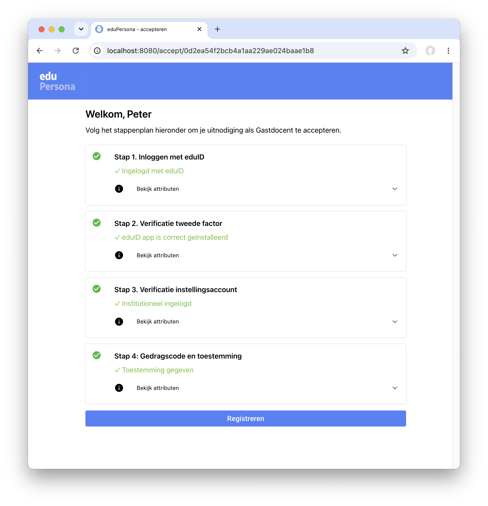

# eduPersona onboarding 

> **Juli 2026 -- verificatie identiteitsbewijs:** Dankzij integratie van **didit.me** is het nu mogelijk om verificatie van identiteitsbewijzen (en dus van bijvoorbeeld naamgegevens en geboortedatum) direct vanuit eduPersona te doen. Zie [CHANGELOG.md](CHANGELOG.md) voor meer details.

### Wat is eduPersona?

<b>TL;DR:</b> Een self-service pagina die de eduID van gastgebruikers betrouwbaar koppelt aan instellingsidentiteiten. Het type gast &ndash;de **persona**&ndash; bepaalt het stappenplan dat de gast doorloopt, waarbij hij/zij stap voor stap begeleid wordt tot aan alle onboarding-eisen is voldaan. Bij afronding koppelt eduPersona de geverifieerde gastgegevens terug naar de instelling. Je kunt het ook zien als een flexibele **verificatiefabriek**.

### Hoe werkt het?


Het centrale begrip is de **persona**: het *soort* gast (gastdocent, alumnus, promotor, ...). Voor elke persona kunnen er andere eisen gesteld worden aan de onboarding en verificatie. In eduPersona bepaalt de gekozen persona de verificatiestappen die moeten worden doorlopen, de mail templates en de gegevenssets die worden meegenomen in de uitnodiging en teruggeleverd aan IAM. Rollen en autorisaties zijn buiten sccope van eduPersona &ndash; dat hoort in de IAM-keten van de instelling. 

De nummering volgt de figuur hierboven:

1. **Primaire registratie** van een gast vindt plaats in een bronsysteem en/of IAM. Dit leidt tot het toekennen van een `guest_id` in IAM. Meestal zal ook worden vastgelegd om wat voor *soort* gast het gaat: dat bepaalt de *persona*.
2. **De uitnodiging wordt aangemaakt**  via de API: in de regel zal dat vanuit IAM of gastregistratie gebeuren, maar het kan ook interactief via de simulator-pagina, zie *Getting started*.
3. **eduPersona stuurt een uitnodiging met code** naar de gast. Voor uitgaande mail kun je een SMTP-stekker of Postmark gebruiken, met templates en gegevens die per persona verschillend kunnen zijn.
4. **De gast accepteert en volgt het stappenplan** op de self-service-pagina `/accept/{invitation_id}`. Per persona kan dat plan verschillen: inloggen met eduID, een MFA-controle, verificatie met een tweede instelling of Entra ID, een check tegen een alumni-DB, verificatie van een paspoort of ID-kaart via Didit (document + liveness + gezichtsvergelijking), enzovoort. Voor elke stap kunnen we de teruggeleverde attributen controleren &ndash; op meegegeven ACR's (bijv. tweede factor) én tegen de uitnodiging zelf (bijv. de naam op het ID-bewijs tegen de naam in de uitnodiging) &ndash; en de gebruiker bijsturen als nadere verificatie of configuratie nodig is. 
5. **Als onboarding is afgerond** verrijkt eduPersona de gastgegevens met het eduID-pseudoniem en/of overige verzamelde gegevens. Dat kan met een **POST naar een callback API** &ndash; of via **SCIM** (zie hieronder.
6. Vanuit IAM zal nu **provisioning** van accounts en autorisaties naar doelsystemen plaatsvinden. 
7. **De gast kan nu inloggen met eduID** op zijn/haar applicaties &ndash; hetzij doordat het eduID-pseudoniem in de applicatie zelf is opgenomen, hetzij door de eduID af te beelden op de instellingsidentiteit. 

Bij die laatste stap kan het wenselijk zijn om weliswaar *in te loggen* met eduID, maar naar de applicaties toe gebruik te blijven maken van een instellingsidentiteit. Daarvoor kun je denken aan het anyID/keyring-scenario van Aventus (gebaseerd op Keycloak) en/of de <a href="https://servicedesk.surf.nl/wiki/spaces/IAM/pages/222462401/Ondersteuning+voor+applicaties+zonder+multi-identifier+functionaliteit">instellings-informatie API</a> van SURFconext. Zo'n voorziening kan dan in stap 6 worden voorzien van de afbeelding van `eduID` op `guest_id`.

### Probeer het op edupersona.nl

We hebben een demo/PoC-omgeving draaien op [https://edupersona.nl/](https://edupersona.nl/) <br>[Registreer je daar](https://edupersona.nl/register) als je tijdelijke admin credentials wilt hebben om e.e.a. in de praktijk te proberen. Je wordt dan via edupersona uitgenodigd - en daarna log je dus ook in met je eduID.

### Zelf installeren

Eventueel eerst een conda env of venv met Python 3.12+ maken en activeren, daarna:
```
mkdir edupersona && cd $_
git clone https://github.com/kleynjan/eduPersona.git .
pip install -r requirements.txt
cp settings.example.json settings.json
```
Edit je settings.json, pas in elk geval het userid en wachtwoord voor `tenants.hvh.fallback_admins` aan. De SQLite-database (`edupersona.db`) wordt bij de eerste start automatisch aangemaakt.
Om eduID of andere IDP's te gebruiken moet je de benodigde OIDC client_id's en secrets configureren in settings.json en deze registreren bij SURFconext (SP dashboard) en/of de betrokken IDP. 

Start een lokale dev server met:
```
./start.sh dev
```

Ga dan met je browser naar http://localhost:8080/, klik op "Log in als beheerder" en log in met je fallback_admin credentials.

Je ziet nu de **invitations**-pagina (het overzicht van uitnodigingen) en de **simulator**. De simulator is de snelste manier om met de hand een persona-uitnodiging te maken:
* open de **simulator**, kies een persona, vul een `guest_id` en e-mailadres in en maak de uitnodiging aan;
* ... als je de Postmark- of SMTP-config hebt ingesteld kun je de invite per mail versturen ...
* anders: open de uitnodiging in het overzicht en kopieer de code.

Je hebt nu de code waarmee een gast de onboarding kan starten:
* ga naar http://localhost:8080/accept<br>
* voer de code in en volg de aangegeven stappen;
* na succesvolle afronding is het eduID-pseudoniem geregistreerd, vindt de terugkoppeling plaats en wordt de gast doorgeleid naar zijn/haar welkomstscherm.




### Voorbeeld-persona's: gastdocent, alumnus en admin

In de repo zijn drie voorbeeld-persona's opgenomen (gedefinieerd in `settings.json`). De drie tabellen hieronder vatten per persona het stappenplan, de gegevens in de uitnodiging en de terugkoppeling naar IAM samen. De gastdocent is een soort showcase van de belangrijkste beschikbare stappen.

| **GASTDOCENT** | bezoekende docent met een account bij een andere instelling |
|:---|:---|
| **Stappenplan** | 1. Inloggen met eduID, zonodig eerst aanmaken (OIDCLoginStep)<br>2. Verificatie van sterke authenticatie via een geforceerde MFA-herlogin bij eduID (OIDCLoginStep met `acr_value`), eventueel eduID-app laten installeren<br>3. Verificatie van het identiteitsbewijs (paspoort of NL ID-kaart) met document-, liveness- en gezichtscontrole via Didit; de achternaam op het document wordt gematcht tegen de uitnodiging (VerifyIdDiditStep)<br>4. Verificatie van een instellings-account via de DIY-IDP van SURFconext (OIDCLoginStep)<br>5. Akkoord gedragscode en gegevensbescherming |
| **Gegevens in uitnodiging** (expected_params) | faculteit, personal_message |
| **Terug naar IAM** (callback_outputs) | eduID-pseudoniem (bijv. sub, uit de eduid_login-stap)<br>acr (authenticatieniveau, geverifieerd in de verify_mfa-stap)<br>geverifieerde ID-gegevens (naam, documentnummer, geboortedatum e.d., uit de id_document-stap) |

| **ALUMNUS** | oud-student, geverifieerd via een alumni-database |
|:---|:---|
| **Stappenplan** | 1. Inloggen met eduID (OIDCLoginStep)<br>2. Opzoeken van de alumnus in een (dummy) alumni-database (VerifyAlumniDb)<br>3. Puur als voorbeeld van een stap met meerdere substappen: (dummy) verificatie van het mobiele nummer (VerifyMobileStep) |
| **Gegevens in uitnodiging** (expected_params) | geen |
| **Terug naar IAM** (callback_outputs) | eduID-pseudoniem (bijv. sub, uit de eduid_login-stap)<br>alumnus_id (uit alumni_db)<br>geverifieerd mobiel nummer (uit verify_mobile) |

| **ADMIN** | self-enrollment van geïnteresseerden, die als beheerder toegang krijgen in de PoC |
|:---|:---|
| **Stappenplan** | 1. Inloggen met eduID (OIDCLoginStep)<br>2. Achtergrondinformatie van de aanvrager ophalen &ndash; organisatie en toepassingsscenario (CollectIntakeStep) |
| **Gegevens in uitnodiging** (expected_params) | geen (self-service aanvraag) |
| **Terug naar IAM** (callback_outputs) | organisatie, toepassingsscenario |

De bijbehorende mailtemplates staan in `services/postmark/templates/personas/` (bijv. `gastdocent.jinja2`).

Voor je eigen instelling zul je persona's en stappenplannen willen aanpassen. Als beginpunt kun je [**dit document**](/docs/customisation.md) gebruiken.


### API

eduPersona biedt een REST API, met `invitations` als enige first-class entiteit: aanmaken (+ mail versturen), opvragen (lijst, enkel, lookup op code), opnieuw versturen en intrekken &ndash; allemaal onder `/api/v1/{tenant}/invitations`. De API is zelf-documenterend via [/docs](https://edupersona.nl/docs), [/redoc](https://edupersona.nl/redoc) en [/openapi.json](https://edupersona.nl/openapi.json) . Stel in settings.json de `tenants.<tenant>.api_key` in als je de API wilt gaan gebruiken.

### Gebruikte tools

* [NiceGUI](https://nicegui.io/) maakt het mogelijk web-applicaties geheel in Python te realiseren, zonder scheiding tussen front- en back-end. Op die manier kunnen we een onboarding-stap in één Python-bestand definiëren, zowel de bedrijfslogica als de gebruikersinterface van de kaart. Onder de motorkap is NiceGUI gebaseerd op next-gen Python frameworks als FastAPI en Starlette.

* [Tortoise ORM](https://tortoise.github.io) is een async ORM die o.a. PostgreSQL, MySQL/MariaDB en SQLite ondersteunt. De code base hier maakt een SQLite database aan (edupersona.db), maar als je init_db aanpast kun je ook een andere back-end gebruiken.

* [SCIM2-models](https://scim2-models.readthedocs.io/en/latest/) en scim2-client worden gebruikt voor de optionele SCIM-koppeling. Dit zijn Python libraries die gebruikmaken van Pydantic data modellen -- een standaard-onderdeel van de FastAPI-stack dat we ook gebruiken voor de eduPersona API.

* [nicegui-rdm](https://github.com/kleynjan/nicegui-rdm) is een bibliotheek om snel 'CRUD' apps te bouwen met NiceGUI. Het biedt een reactief store/observer-model dat wordt gebruikt om de user interface bij te werken zonder dat een page reload nodig is.

* [Didit](https://didit.me) levert de identiteitsverificatie (document-OCR + liveness + gezichtsvergelijking) achter `VerifyIdDiditStep`. De gast scant een QR-code met de telefoon en doorloopt de controle daar; de desktop-app blijft leidend en pollt de uitkomst, zodat de flow zonder redirect of publieke inbound-URL werkt (ook lokaal). De QR-code wordt gegenereerd met [segno](https://segno.readthedocs.io/). Zie [docs/didit.md](docs/didit.md) voor de configuratie en het ontwerp.

* [Uvicorn](https://uvicorn.dev/) is de ASGI server die we gebruiken om de eduPersona app stabiel te ontsluiten. In dev richt je je browser rechtstreeks op het uvicorn proces (zie `start.sh`); in productie zul je er meestal een Nginx reverse proxy (of vergelijkbaar) voor zetten, al is het alleen maar voor de TLS/SSL-afhandeling.  

### Requirements

- Python >= 3.12
- NiceGUI >= 3.0, < 4.0
- Tortoise ORM >= 1.0.0, < 2.0.0
- PyJWT
- pytz
- httpx
- segno
- scim2-client[httpx]
- scim2-models
- aiosmtplib
- nicegui-rdm

Zie requirements.txt (en requirements-test.txt als je de tests wilt kunnen uitvoeren).

### Constraints

Aandachtspunt: eduID-pseudoniemen zijn per instelling (en desgewenst zelfs per applicatie) uniek. Om deze reden moet eduPersona (of de gebruikte eduPersona tenant) als SP/RP in dezelfde scope worden opgenomen als de instellingssystemen waarop (of waarmee) straks met eduID wordt ingelogd. 

### TODO / BACKLOG

* Na didit ID verificatie op een mobiel device moet de gebruiker zelf terugschakelen naar de originele tab. TODO: didit callback gebruiken. 

### License
This project is licensed under the GNU Affero General Public License (AGPL) version 3.
