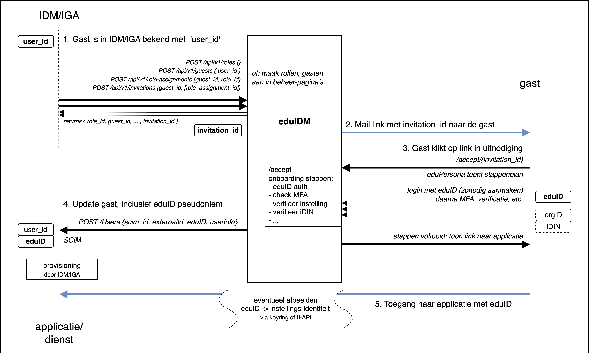
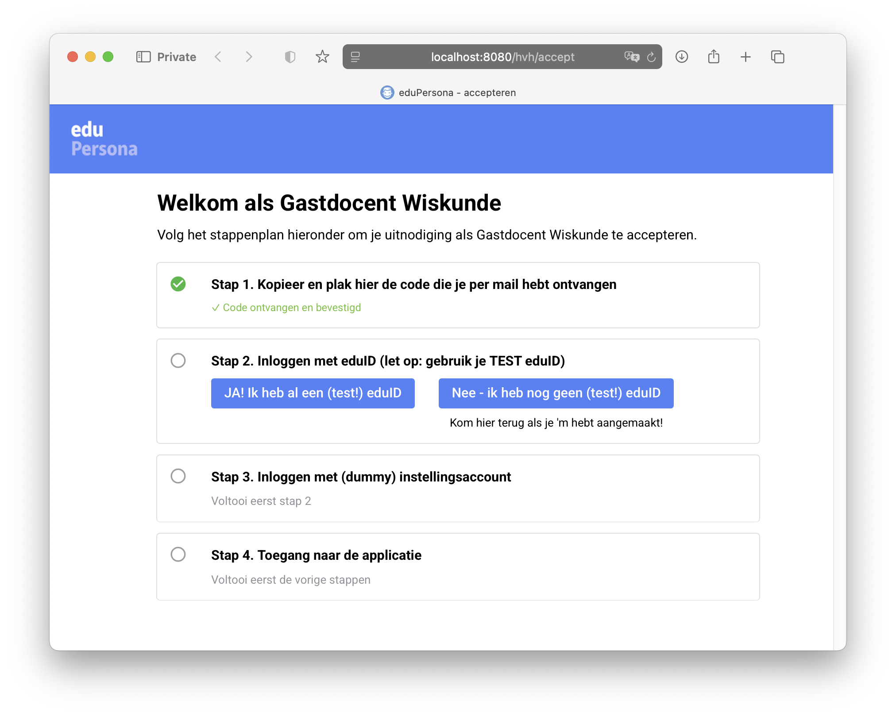

## **eduPersona onboarding**: landingspagina voor matching & verificatie van eduID users

Proof of Concept van een self-service pagina om interne identiteiten te verrijken met eduID-pseudoniem (en eventueel -attributen), waarbij de verificatie naar wens kan worden ingericht en de gastgebruiker stap voor stap begeleid wordt in het 'onboarding'-proces.

Werkwijze (zie ook figuur):

1. Maak een **gast** aan en ken een **rol** toe. Structureel zul je dat willen doen vanuit instellings-IGA/IDM, maar het kan ook (bijvoorbeeld in een PoC) interactief in eduPersona. Die rol moet ook gedefinieerd worden, uiteraard &ndash; zelfde verhaal.
2. Maak een **uitnodiging** aan voor deze gast en rol en verzend deze: eduPersona kan SMTP stekker of Postmark gebruiken voor uitgaande mail en biedt templates die per tenant kunnen worden ingesteld -- maar uiteraard kan de verzending ook vanuit IGA/IDM plaatsvinden.  

3. De gast opent de link naar de self-service-pagina "/accept", of kopieert en plakt de code. Daar leiden we hem/haar door de stappen die nodig zijn om toegang te geven. Voor elke IDP (inclusief maar niet beperkt tot eduID) kunnen we controles doen op attributen (naam, mailadres e.d.) en op meegegeven ACR's (bijv. tweede factor) - en de gebruiker de goede kant opsturen als nadere verificatie of configuratie nodig is. 

4. Net als SURF Invite ondersteunt eduPersona SCIM voor de terugkoppeling van gasten en hun (geaccepteerde) rollen naar instellings-IGA/IDM (zie `settings.json`, `tenants.hvh.scim`). In de regel gebeurt dit *na afronding van de onboarding*.

5. Na afronding van het stappenplan tonen we de gast een link naar zijn/haar applicaties of diensten, zodat de gast daar direct kan inloggen.


<br>



De link tussen instellingsaccount en eduID die hier wordt vastgelegd zou vervolgens kunnen worden gebruikt om via de <a href="https://servicedesk.surf.nl/wiki/spaces/IAM/pages/222462401/Ondersteuning+voor+applicaties+zonder+multi-identifier+functionaliteit">instellings-informatie API</a> het instellingsaccount mee te geven bij het inloggen. Dat maakt integratie van eduID in het applicatielandschap aanzienlijk eenvoudiger (vgl. anyID/keyring scenario van Aventus).


### Relatie met SURF Invite

SURF Invite is vooral te beschouwen als een *autorisatie-tool*, met als uitgangspunt dat het autorisatiepakket voor gasten kan worden bepaald op basis van Invite rollen. De principiële koers vanuit SURF Access is dat de eduID identiteit centraal staat en dat *bij het inloggen* het benodigde autorisatiepakket wordt meegeleverd. 

eduPersona heeft als vertrekpunt dat een *instellingsidentiteit* in een 'onboarding-scenario' wordt verrijkt met o.a. eduID &ndash; dus *als onderdeel van de levenscyclus*. Als de benodigde verificaties eenmaal hebben plaatsgevonden (en het betrouwbaarheidsniveau is voldoende hoog), dan is daarna bij het inloggen geen enkele afhankelijkheid meer van attributen/claims die verder worden meegeleverd.

Kortom: eduPersona is een self-service pagina die ervoor zorgt dat de *instelling* zekerheid heeft wie er precies straks met eduID inlogt en bovendien dat de externe *gebruiker* een goede 'onboarding' ervaring heeft:




### Getting started

Eventueel eerst een conda env of venv met Python 3.12+ maken en activeren, daarna:
```
mkdir edupersona && cd $_
git clone https://github.com/kleynjan/eduPersona.git .
pip install -r requirements.txt
cp settings.example.json settings.json
```
Edit je settings.json, pas in elk geval het userid en wachtwoord voor tenants.hvh.fallback_admins aan.

Start een lokale dev server met:
```
./start.sh dev
```

Ga dan met je browser naar http://localhost:8080/, klik op Beheer en log in met je fallback_admin credentials.

Je hebt initieel een lege database, dus:
1. voer een gast op
1. voer een rol op
1. ken de rol toe aan de gast
1. en maak een nieuwe uitnodiging voor die gast en rol
<br>... als je de Postmark of SMTP config hebt ingesteld kun je de invite per mail versturen ... 
2. anders: klik op de uitnodiging en kopieer de code

Je hebt nu de code waarmee een gast de onboarding kan starten:
* ga naar http://localhost:8080/hvh/accept
* voer de code in en volg de aangegeven stappen
* ...
Als je eduID en/of instellings-logins echt wilt testen zul je de benodigde OIDC client_id's en secrets moeten configureren in settings.json en het eduPersona portal registreren bij SURFconext(-test) en/of de betrokken IDP. (Dit kan óók met een dev omgeving op localhost.)

We hebben een demo-/PoC-omgeving draaien op [https://edupersona.nl/](https://edupersona.nl/) . Stuur een mail naar [peter.kleynjan@m-7.nl](mailto:peter.kleynjan@m-7.nl) als je tijdelijke admin credentials wilt hebben om e.e.a. in de praktijk te proberen.

### Inrichting, features, configuratie

* Het **onboarding stappenplan** is flexibel, want gedefinieerd via configuratie (settings.json: `tenants.hvh.steps`) - waarbij 'kaarten' worden gebruikt die zijn gedefinieerd in `domain/step_cards.py`.

* Voor het **verzenden van de uitnodiging** wordt ondersteuning van SMTP en Postmark geboden. Mailberichten worden opgesteld via Jinja2 HTML-templates. Afzenders kunnen per rol worden geconfigureerd.

* eduPersona is fundamenteel **multi-tenant**, ook als je dat niet gebruikt. De default tenant die je overal tegenkomt is 'hvh': de beruchte Hogeschool van Harderwijk. Je kunt in settings.json je eigen tenant-string als key opnemen onder de `tenants` key. 

* **SCIM**: eduPersona gebruikt een store/observer-patroon om alle mutaties van gebruikers, rollen e.d. via SCIM terug te synchroniseren &ndash; meestal zal dat naar een IDM/IGA-systeem zijn.

* **IDP instellingen**: de `admin` IDP (settings.json: `tenants.hvh.oidc.admin`) wordt gebruikt om in te loggen op de beheersfuncties. De overige IDP's onder de `oidc` key worden gebruikt in het stappenplan dat de gast bij onboarding moet doorlopen. Uiteraard moet je jouw eduPersona SP/RP bij elke IDP (c.q. SURFconext, Entra ID) als zodanig registreren met een client_id en client_secret.

* **Meertalig**: alle strings zijn Engels met als default een vertaling naar het Nederlands actief. Andere talen kunnen worden toegevoegd in `services.i18n`.

* **Cleanup**: er is een apart endpoint `/api/v1/cleanup` met een bijbehorende API-key om verlopen rollen en roltoekenningen e.d. op te ruimen. Zorg dat dit endpoint ten minste één keer per dag wordt aangeroepen, bijv. via crontab.

### API

eduPersona biedt een volledige API met 28+ endpoints. Naast primitieven voor guests, roles, role assignments, invitations etc worden er enkele 'convenience' API's geboden om bijvoorbeeld een 'quick invite' te kunnen doen (met alle benodigde objecten) en `create_invite_role` die een klein maar essentieel stukje van de SURF Invite API emuleert. De API is zelf-documenterend via http://localhost:8080/docs, /redoc en /openapi.json

Stel in settings.json de `tenants.hvh.api_key` in als je de API wilt gaan gebruiken.


### Architectuur

* [NiceGUI](https://nicegui.io/) maakt het mogelijk om web apps te maken met alleen Python. NiceGUI maakt gebruik van FastAPI en Starlette als onderliggende infrastructuur.

* [Tortoise ORM](https://tortoise.github.io) is een async ORM die o.a. PostgreSQL, MySQL/MariaDB en SQLite ondersteunt. De code base hier maakt een SQLite database aan (edupersona.db), maar als je init_db aanpast kun je ook een andere back-end gebruiken.

* [SCIM2-models](https://scim2-models.readthedocs.io/en/latest/) en de bijbehorende libs (client, server, etc.) worden gebruikt voor SCIM support. Dit zijn Python libraries die gebruikmaken van Pydantic data modellen -- een standaard-onderdeel van de FastAPI-stack dat we ook gebruiken voor de eduPersona API.

* [nicegui-rdm](https://github.com/kleynjan/nicegui-rdm) is een bibliotheek om snel 'CRUD' apps te bouwen met NiceGUI. Het biedt een reactief store/observer-model dat wordt gebruikt om de user interface bij te werken zonder dat een page reload nodig is -- en de eduPersona SCIM drivers zijn als observer geregistreerd op de relevante stores. 

* [Uvicorn](https://uvicorn.dev/) is de ASGI server die we gebruiken om de eduPersona app stabiel te ontsluiten. In dev richt je je browser rechtstreeks op het uvicorn proces (zie `start.sh`); in productie zul je er meestal een Nginx reverse proxy (of vergelijkbaar) voor zetten, al is het alleen maar voor de TLS/SSL-afhandeling.  

### Requirements

- Python >= 3.12
- NiceGUI >= 3.0, < 4.0
- Tortoise ORM >= 1.0.0, < 2.0.0
- PyJWT
- pytz
- httpx
- scim2-client[httpx]
- scim2-models
- aiosmtplib
- nicegui-rdm

Zie requirements.txt (en requirements-test.txt als je de tests wilt kunnen draaien).

### Disclaimer

Let op, er wordt nog druk gesleuteld aan deze code. Onder andere is het de bedoeling om de beheersinterface (gasten, rollen) af te splitsen, zodat de 'onboarding' module zo licht mogelijk wordt. 

### License
This project is licensed under the GNU Affero General Public License (AGPL) version 3.
