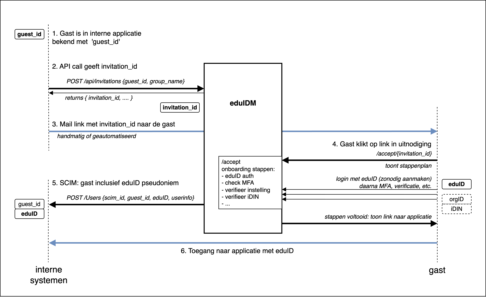
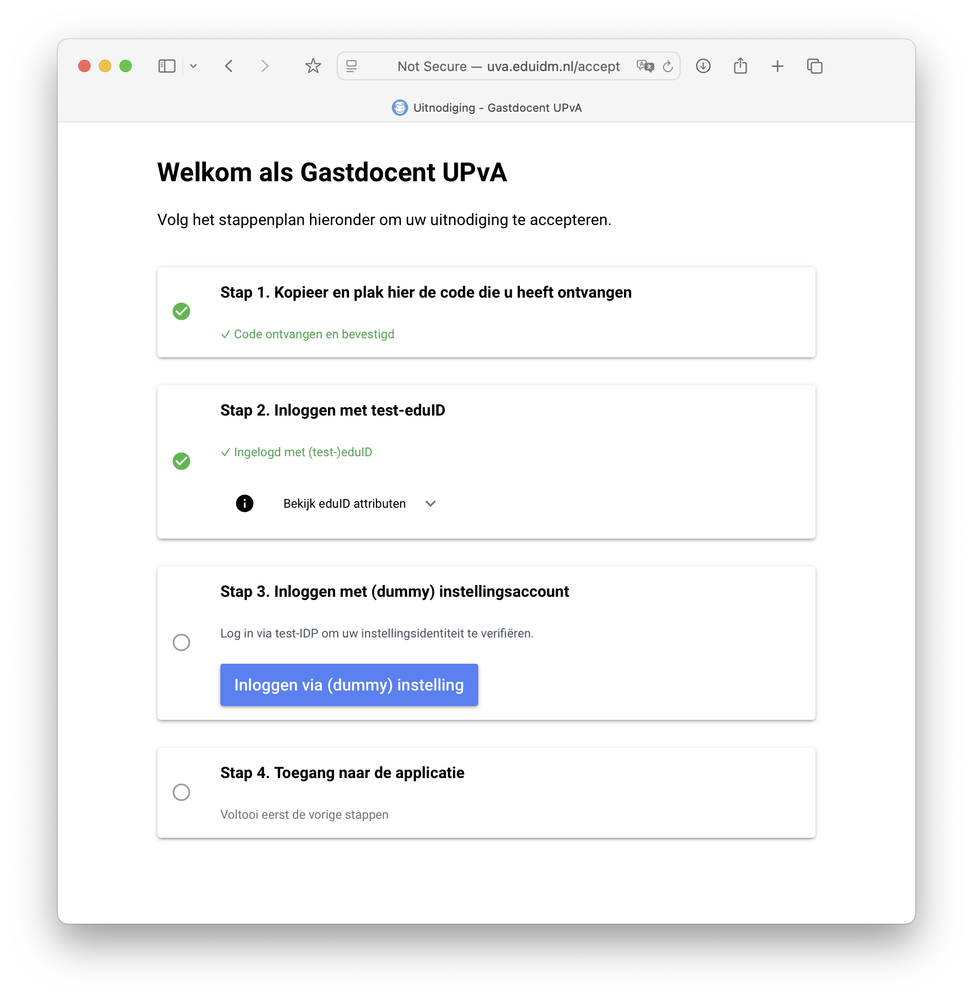

## eduPersona: landingspagina voor matching & verificatie van eduID users

Proof of Concept van een self-service pagina om interne accounts te verrijken met eduID-identiteit en -attributen.

Werkwijze (zie ook figuur):

1. Registreer de gebruiker intern (in applicatie en/of IDM/IAM) met een een interne of gast-identifier. 

2. Maak via de API een uitnodiging aan via edupersona en onthoud de uitnodigingscode.

3. Stuur de code naar de gast, bijvoorbeeld per mail.

4. De gast opent de link naar (of voert de code in op) de self-service-pagina "/accept". Daar leiden we hem/haar door de stappen die nodig zijn om toegang te geven. In deze PoC is het stappenplan grotendeels 'fake'. 

5. edupersona stuurt het eduID-pseudoniem en -info naar de callback die voor de betreffende groep is geconfigureerd. De applicatie (of IDM/IAM/etc) associeert de eduID met de interne identiteit, en/of vervangt de loginnaam door de eduID EPPN.

6. Na afronding van het stappenplan tonen we de gast een link naar de applicatie die met de uitnodigingsgroep is geassocieerd, zodat de gast daar direct met eduID kan inloggen.

<!--  -->

API:
| endpoint               | verb   |                                                            |
|------------------------|--------|------------------------------------------------------------|
| /api/invitations       | GET    | Ophalen alle uitnodigingen                                 |
| /api/invitations       | POST   | Nieuwe uitnodiging: guest_id & group_name -> invitation_id | 
| /api/groups            | GET    | Ophalen alle groepen (read only op dit moment)             |

Interactief:
| URL                       |                                                                  |
|---------------------------|------------------------------------------------------------------|
| /accept/{invitation_id}   | Start onboarding na ontvangst van invitation_id (per mail bv.)   |
| /m/invitations            | Bekijk uitnodigingen + interactief aanmaken van nieuwe           |
| /m/groups                 | Beheer groepen                                                   |

Voor deze PoC wordt de data opgeslagen in `(services.storage.)storage.json` en kan daar direct worden bewonderd en aangepast. Voor een productie-app ligt een database meer voor de hand.

### Relatie met SURF Invite

SURF Invite is vooral te beschouwen als een *autorisatie-tool*, met als uitgangspunt dat het autorisatiepakket voor gasten kan worden bepaald op basis van Invite rollen.

Hier kiezen we als vertrekpunt dat Invite en/of edupersona vooral als *onboarding* tool wordt gebruikt en dat de autorisaties (en mogelijk de levenscyclus van de identiteit) primair worden bepaald in de IAM-tooling van de instelling. edupersona is erop gericht om eduID betrouwbaar te koppelen aan de instellingsidentiteit.

De self-service functionaliteit van eduPersona zorgt ervoor dat de *instelling* zekerheid heeft wie er precies straks met eduID inlogt en bovendien dat de externe *gebruiker* een goede 'onboarding' ervaring heeft:

<!--  -->

eduPersona kan dus in het verlengde van de interne IDM-voorziening (derdenregistratie e.d.) worden ingezet als *alternatief* voor Invite, maar ook als *custom landingspagina* in combinatie met Invite.

Toekomstmuziek: de link tussen instellingsaccount en eduID die hier wordt vastgelegd zou vervolgens kunnen worden gebruikt om via de <a href="https://servicedesk.surf.nl/wiki/spaces/IAM/pages/222462401/Ondersteuning+voor+applicaties+zonder+multi-identifier+functionaliteit">instellings-informatie API</a> het instellingsaccount mee te geven bij het inloggen. Dat maakt integratie van eduID in het applicatielandschap aanzienlijk eenvoudiger (vgl. anyID/keyring scenario van Aventus).

### Getting started

Eventueel eerst een conda env of venv met Python 3.12+ maken en activeren, daarna:
```
mkdir edupersona && cd $_
git clone https://github.com/kleynjan/eduPersona.git .
pip install -r requirements.txt
cp settings.example.json settings.json
```
Edit je settings.json, pas in elk geval het userid en wachtwoord voor tenants.hvh.fallback_admins aan.

Start een lokale dev server met:
```
./start.sh dev
```

Ga dan met je browser naar http://localhost:8080/, klik op Beheer en log in met je fallback_admin credentials.

Je hebt initieel een lege database, dus:
1. voer een gast op
1. voer een rol op
1. ken de rol toe aan de gast
1. en maak een nieuwe uitnodiging voor die gast en rol
<br>... als je de Postmark of SMTP config hebt ingesteld kun je de invite per mail versturen ... 
2. anders: klik op de uitnodiging en kopieer de code

Je hebt nu de code waarmee een gast de onboarding kan starten:
* ga naar http://localhost:8080/hvh/accept
* voer de code in en volg de aangegeven stappen
* ...
Als je eduID en/of instellings-logins echt wilt testen zul je de benodigde OIDC client_id's en secrets moeten configureren in settings.json en het eduPersona portal registreren bij SURFconext(-test) en/of de betrokken IDP. (Dit kan óók met een dev omgeving op localhost.)

De **API** is gedocumenteerd via /docs, /redoc en /openapi.json


### Configuratie

Kopieer `settings.json.org` naar `settings.json` en pas aan naar eigen inzicht. 
 
* de `admin` IDP wordt gebruikt om in te loggen op de backend (groepen en uitnodigingen)

* de overige IDP's worden gebruikt in het stappenplan (zie ook `components/step_cards.py`) dat de gast bij onboarding moet doorlopen

Maak de OIDC RP (client_id, client_secret) aan in het SP dashboard van SURFconext.

Start de applicatie met `python main.py` en ga met je browser naar `http://localhost:8090/`

### FMO
1. Define/add groups in eduPersona via API or interactively.
1. In eduPersona, add guest and assign to group; eduPersona sends invitation.
1. eduPersona optionally provisions 'preliminary guest' to institution using SCIM, allowing authorization assignments etc. (eduPersona is the SCIM *client*)
1. Guest visits eduPersona /{tenant}/accept page and follows the steps shown there (secondary logins, provide info, verification).
1. Once onboarding is complete, eduPersona provisions final guest data to institution application or IDM (again using SCIM).
1. Guest is shown link(s) that they can use to access their application.
1. Optionally: use institutional information API (attribute authority) to add secondary id collected in onboarding stage to the eduID login.

### License
This project is licensed under the GNU Affero General Public License (AGPL) version 3.
